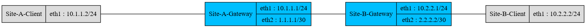

## Goal



## Todo 
Create an ansible script which generate the topology:
[x] Create the csrx-1, csrx-2 and arista-1 and publish their SSH Ports (Done with containerlab)
[x] Create the ansible inventory file for the csrx-1, csrx-2 and arista-1 (Done with containerlab)
[x] Create one docker network bridge per connection (Done with containerlab)
[x] Attache the bridges to csrx-1, csrx-2 and arista-1 (Done with containerlab)
[x] Create the two client containers and the server and attach them to the correponding briges (Done with containerlab)
- Create a ip_reachability.yml and ip_unreachability.yml and call them in the main script
- Configure the clients
- Configure the VPN gateway with abase config
- Test that all point to point links can ping
- Test that both client cannot ping
- Push the IPSEC Service to csrx-1, csrx-2
- Test that both clients can ping and display the path through a traceroute

## Create an alpine container with SSH
Per default, alpine does not come with OpenSSH installed.
We will create a docker image containing OpenSSH, with root login activated (login: root / password: root).
Source: https://github.com/oadiazm/alpine-ssh/

```
docker build -t alpine-ssh /vagrant_data/containers/alpine-ssh/
```

## Initiate the topolgy using containerlab

Containerlab will generate temporary files in the current directory. Make sur that you are in a writeable directory (/vagrant_data might not work)
```
vagrant@ubuntu-18:~$ pwd
/home/vagrant
```

### Start the topology
```
vagrant@ubuntu-18:~$ sudo containerlab deploy --topo /vagrant_data/DeployNetworkServices/ipsec_ceos.clab.yaml
INFO[0000] Parsing & checking topology file: ipsec_ceosdocker .clab.yaml
INFO[0000] Creating lab directory: /home/vagrant/clab-IPSEC-VPN
INFO[0000] Creating container: site_b_client
INFO[0000] Creating container: site_a_client
INFO[0000] Creating container: site_a_gateway
INFO[0000] Creating container: site_b_gateway
INFO[0004] Restarting 'site_b_gateway' node
INFO[0004] Restarting 'site_a_gateway' node
INFO[0007] Creating virtual wire: site_a_gateway:eth2 <--> site_b_gateway:eth2
INFO[0007] Creating virtual wire: site_a_gateway:eth1 <--> site_a_client:eth1
INFO[0007] Creating virtual wire: site_b_gateway:eth1 <--> site_b_client:eth1
INFO[0007] Writing /etc/hosts file
+---+-------------------------------+--------------+------------------+-------+-------+---------+----------------+----------------------+
| # |             Name              | Container ID |      Image       | Kind  | Group |  State  |  IPv4 Address  |     IPv6 Address     |
+---+-------------------------------+--------------+------------------+-------+-------+---------+----------------+----------------------+
| 1 | clab-IPSEC-VPN-site_a_client  | 15d563310d61 | alpine:latest    | linux |       | running | 172.20.20.5/24 | 2001:172:20:20::5/64 |
| 2 | clab-IPSEC-VPN-site_a_gateway | fbc5badc3a99 | ceosimage:latest | ceos  |       | running | 172.20.20.2/24 | 2001:172:20:20::2/64 |
| 3 | clab-IPSEC-VPN-site_b_client  | c8825c7c3735 | alpine:latest    | linux |       | running | 172.20.20.4/24 | 2001:172:20:20::4/64 |
| 4 | clab-IPSEC-VPN-site_b_gateway | ed3099e21370 | ceosimage:latest | ceos  |       | running | 172.20.20.3/24 | 2001:172:20:20::3/64 |
+---+-------------------------------+--------------+------------------+-------+-------+---------+----------------+----------------------+


vagrant@ubuntu-18:~$ docker ps -a
CONTAINER ID        IMAGE               COMMAND                  CREATED             STATUS              PORTS                                         NAMES
fbc5badc3a99        ceosimage:latest    "/sbin/init systemd.…"   15 seconds ago      Up 8 seconds                                                      clab-IPSEC-VPN-site_a_gateway
ed3099e21370        ceosimage:latest    "/sbin/init systemd.…"   15 seconds ago      Up 9 seconds                                                      clab-IPSEC-VPN-site_b_gateway
c8825c7c3735        alpine:latest       "/bin/sh"                15 seconds ago      Up 12 seconds                                                     clab-IPSEC-VPN-site_b_client
15d563310d61        alpine:latest       "/bin/sh"                15 seconds ago      Up 10 seconds                                                     clab-IPSEC-VPN-site_a_client
```

### Test SSH 

#### Test the SSH access to the arista cEOS devices
Note: it usually takes two minutes for the arista cEOS to boot-up, you can verify the logs with the command "docker logs clab-IPSEC-VPN-site_a_gateway".
```
vagrant@ubuntu-18:~$ ssh admin@clab-IPSEC-VPN-site_a_gateway
The authenticity of host 'clab-ipsec-vpn-site_a_gateway (2001:172:20:20::2)' can't be established.
ECDSA key fingerprint is SHA256:ulSKvFQNWLDWurYXVKkPENWtxZ4qNupqNWMuJNHv84k.
Are you sure you want to continue connecting (yes/no)? yes
Warning: Permanently added 'clab-ipsec-vpn-site_a_gateway,2001:172:20:20::2' (ECDSA) to the list of known hosts.
Password:
site_a_gateway>enable
site_a_gateway#
```

#### Test the SSH access to the alpine linux clients
Note : Only the bourne shell (/bin/sh) and the almquist (/bin/ash) are available. The bourne again shell (/bin/bash) is not installed

```
vagrant@ubuntu-18:~$ ssh root@clab-IPSEC-VPN-site_a_client
root@clab-ipsec-vpn-site_a_client's password:
Welcome to Alpine!

The Alpine Wiki contains a large amount of how-to guides and general
information about administrating Alpine systems.
See <http://wiki.alpinelinux.org/>.

You can setup the system with the command: setup-alpine

You may change this message by editing /etc/motd.

site_a_client:~# echo $SHELL
/bin/ash
```
#### Edit the Ansible inventory
Add the following line to the Ansible inventory generated by containerlab:

* cEOS:
```
          ansible_user: 'admin'
          ansible_ssh_pass: 'admin'
          ansible_connection: ansible.netcommon.httpapi
          ansible_network_os: arista.eos.eos
          ansible_httpapi_use_ssl: true
          ansible_httpapi_validate_certs: false
```

* Alpine:
```
          ansible_user: 'root'
          ansible_ssh_pass: 'root'
```

The inventory file should look like this:
```
vagrant@ubuntu-18:~$ vi clab-IPSEC-VPN/ansible-inventory.yml
all:
  children:
    ceos:
      hosts:
        clab-IPSEC-VPN-site_a_gateway:
          ansible_host: 172.20.20.4
          ansible_user: 'admin'
          ansible_ssh_pass: 'admin'
          ansible_connection: ansible.netcommon.httpapi
          ansible_network_os: arista.eos.eos
          ansible_httpapi_use_ssl: true
          ansible_httpapi_validate_certs: false
        clab-IPSEC-VPN-site_b_gateway:
          ansible_host: 172.20.20.5
          ansible_user: 'admin'
          ansible_ssh_pass: 'admin'
          ansible_connection: ansible.netcommon.httpapi
          ansible_network_os: arista.eos.eos
          ansible_httpapi_use_ssl: true
          ansible_httpapi_validate_certs: false
    linux:
      hosts:
        clab-IPSEC-VPN-site_a_client:
          ansible_host: 172.20.20.2
          ansible_user: 'root'
          ansible_ssh_pass: 'root'
        clab-IPSEC-VPN-site_b_client:
          ansible_host: 172.20.20.3
          ansible_user: 'root'
          ansible_ssh_pass: 'root'
```

