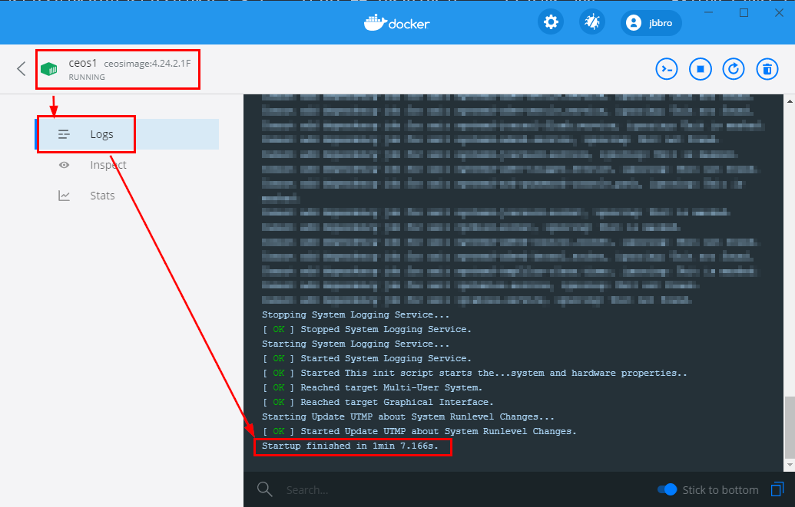

# Building Your Own Lab

I decided to create a lab using Docker for the following reasons : 
1. I always liked docker
2. I want to learn more docker
3. Docker is lightweight
4. WSL2 is available: one can use Linux on their Windows Laptop without managing VMs
5. Arista and Juniper both have docker images, which should be sufficient for lab purpose

## Arista
https://www.arista.com/en/support/software-download 
Download cEOS-Lab (A free account is needed)
Follow the installation instructions (cEOS-lab-README-generic.txt)

### Import the Image
docker import cEOS-lab.tar.xz ceosimage:4.24.2.1F

### Create two docker instances. Variables are provided by Arista in the config file
docker create --name=ceos1 --privileged -e INTFTYPE=eth -e ETBA=1 -e SKIP_ZEROTOUCH_BARRIER_IN_SYSDBINIT=1 -e CEOS=1 -e EOS_PLATFORM=ceoslab -e container=docker -i -t ceosimage:4.24.2.1F /sbin/init systemd.setenv=INTFTYPE=eth systemd.setenv=ETBA=1 systemd.setenv=SKIP_ZEROTOUCH_BARRIER_IN_SYSDBINIT=1 systemd.setenv=CEOS=1 systemd.setenv=EOS_PLATFORM=ceoslab systemd.setenv=container=docker
docker create --name=ceos2 --privileged -e INTFTYPE=eth -e ETBA=1 -e SKIP_ZEROTOUCH_BARRIER_IN_SYSDBINIT=1 -e CEOS=1 -e EOS_PLATFORM=ceoslab -e container=docker -i -t ceosimage:4.24.2.1F /sbin/init systemd.setenv=INTFTYPE=eth systemd.setenv=ETBA=1 systemd.setenv=SKIP_ZEROTOUCH_BARRIER_IN_SYSDBINIT=1 systemd.setenv=CEOS=1 systemd.setenv=EOS_PLATFORM=ceoslab systemd.setenv=container=docker

### Create the docker networks (virtual links) and connect both containers 
docker network create net1
docker network create net2

docker network connect net1 ceos1
docker network connect net1 ceos2
docker network connect net2 ceos1
docker network connect net2 ceos2

### Start the containers
docker start ceos1
docker start ceos2

#### Wait a few minutes.
If you use Docker Desktop you can check the logs:


#### Log in the cEOS
```
admin@docker_server$ docker exec -it ceos2 Cli
localhost>enable
localhost#show interfaces status
Port       Name   Status       Vlan     Duplex Speed  Type            Flags Encapsulation
Et1               connected    1        full   unconf EbraTestPhyPort
Et2               connected    1        full   unconf EbraTestPhyPort
```

### Stop and remove the containers
docker stop ceos1
docker stop ceos2
docker rm ceos1
docker rm ceos2