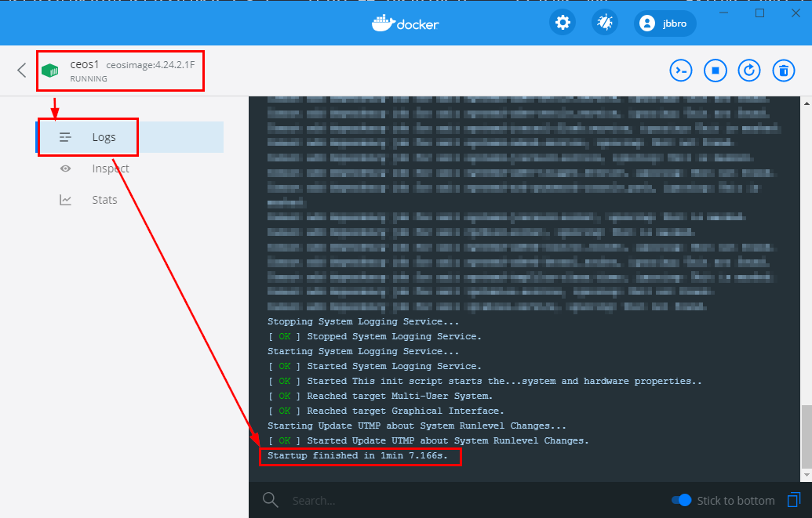

# Arista cEOS-lab
I decided to create a lab using Docker for the following reasons : 
1. I always liked docker
2. I want to learn more docker
3. Docker is lightweight
4. WSL2 is available: one can use Linux on their Windows Laptop without managing VMs
5. Managing VMs on a laptop can be a pain, especially corrupting VMs because the laptop crashed for some reason(BSOD)
5. Arista and Juniper both have docker images, which should be sufficient for lab purpose

## Arista cEOS First Steps
https://www.arista.com/en/support/software-download 
Download cEOS-Lab (A free account is needed)
Follow the installation instructions (cEOS-lab-README-generic.txt)

1. Import the Image
```
docker import cEOS-lab.tar.xz ceosimage:4.24.2.1F
docker image tag ceosimage:4.24.2.1F ceosimage:latest
```

2. Create two docker instances. Variables are provided by Arista in the config file
```
docker create --name=ceos1 --privileged -e INTFTYPE=eth -e ETBA=1 -e SKIP_ZEROTOUCH_BARRIER_IN_SYSDBINIT=1 -e CEOS=1 -e EOS_PLATFORM=ceoslab -e container=docker -i -t ceosimage:latest /sbin/init systemd.setenv=INTFTYPE=eth systemd.setenv=ETBA=1 systemd.setenv=SKIP_ZEROTOUCH_BARRIER_IN_SYSDBINIT=1 systemd.setenv=CEOS=1 systemd.setenv=EOS_PLATFORM=ceoslab systemd.setenv=container=docker
docker create --name=ceos2 --privileged -e INTFTYPE=eth -e ETBA=1 -e SKIP_ZEROTOUCH_BARRIER_IN_SYSDBINIT=1 -e CEOS=1 -e EOS_PLATFORM=ceoslab -e container=docker -i -t ceosimage:latest /sbin/init systemd.setenv=INTFTYPE=eth systemd.setenv=ETBA=1 systemd.setenv=SKIP_ZEROTOUCH_BARRIER_IN_SYSDBINIT=1 systemd.setenv=CEOS=1 systemd.setenv=EOS_PLATFORM=ceoslab systemd.setenv=container=docker
```

3. Create the docker networks (virtual links) and connect both containers 
```
docker network create net1
docker network create net2

docker network connect net1 ceos1
docker network connect net1 ceos2
docker network connect net2 ceos1
docker network connect net2 ceos2
```

4. Start the containers
```
docker start ceos1
docker start ceos2
```

5. Wait a few minutes.
If you use Docker Desktop you can check the logs:


6. Log in the cEOS
```
admin@docker_server$ docker exec -it ceos2 Cli
localhost>enable
localhost#show interfaces status
Port       Name   Status       Vlan     Duplex Speed  Type            Flags Encapsulation
Et1               connected    1        full   unconf EbraTestPhyPort
Et2               connected    1        full   unconf EbraTestPhyPort
```

7. Stop and remove the containers
```
docker stop ceos1
docker stop ceos2
docker rm ceos1
docker rm ceos2
```

## Observations

### Management Port
## Automation Lab
1. Create an out-of-band network which will be used by all the automation containers
```
docker network create oob-automation
```

2. Import cEOS-lab (Free Dowload: https://www.arista.com/en/support/software-download )
```
docker import cEOS-lab.tar.xz ceosimage:4.24.2.1F
```

3. Create a docker-compose.yml file in a dedicated directory: 
```
version: '3'

services:
  ceos-1:
    hostname: CEOS
    image: "ceosimage:latest"
    command: /sbin/init systemd.setenv=INTFTYPE=eth systemd.setenv=ETBA=1 systemd.setenv=SKIP_ZEROTOUCH_BARRIER_IN_SYSDBINIT=1 systemd.setenv=CEOS=1 systemd.setenv=EOS_PLATFORM=ceoslab systemd.setenv=container=docker
    privileged: true
    environment:
      INTFTYPE: eth
      ETBA: 1
      SKIP_ZEROTOUCH_BARRIER_IN_SYSDBINIT: 1
      CEOS: 1
      EOS_PLATFORM: ceoslab
      container: docker
    tty: true
    networks:
      default:

networks:
  default:
    external:
      name: oob-automation
```

4. Exectute docker-compose from the dedicated directory : 
```
docker-compose up -d
```

5. Start the container bash: 
```
docker exec -it YOUR-DIRECTORY_ceos-1_1 /bin/bash
```

6. Verify that the NIC is present: 
```
bash-4.2# ip address
80: eth0@if81: <BROADCAST,MULTICAST,UP,LOWER_UP> mtu 1500 qdisc noqueue state UP group default
    link/ether 02:42:ac:17:00:02 brd ff:ff:ff:ff:ff:ff link-netnsid 0
    inet 172.23.0.2/16 brd 172.23.255.255 scope global eth0
       valid_lft forever preferred_lft forever
```

7. Note that eth0 is not visible in EOS
```
bash-4.2# Cli
localhost>enable
localhost#show interfaces status
localhost#
localhost#
localhost#
localhost#
```

9. Delete the container and add the following lines at the end of the "command:" in docker-compose.yml
* systemd.setenv=MAPETH0=1
* systemd.setenv=MGMT_INTF=eth0
Source: https://eos.arista.com/forum/management-port-on-ceos-missing/

10. Recreate a container with docker compose, Ma0 is now present:
```
localhost#show ip interface brief
                                                                          Address
Interface         IP Address       Status       Protocol           MTU    Owner
----------------- ---------------- ------------ -------------- ---------- -------
Management0       unassigned       up           up                1500
```